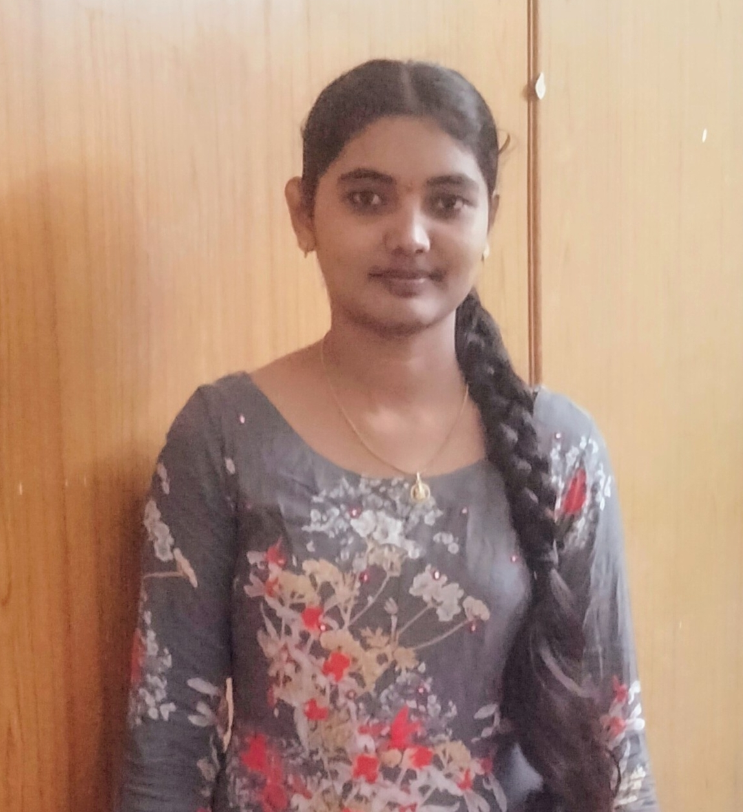

# Prasanna Boddapati
 I am Prasanna Boddapati. I am from Ongole, India. I have completed my under graduation in KITS College AndhraPradesh. After that i worked with DXC Technology as an Data Analyst in Canadian Imperial Bank of Commerce (CIBC) Project. My goal in this course is to improve my database skills and apply my knowledge to use several database frameworks where I can reach my goal of becoming a professional Data Scientist/Analyst.
 

